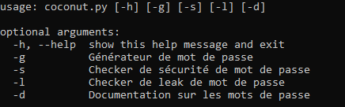
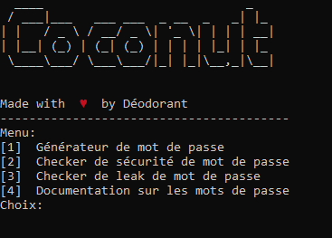
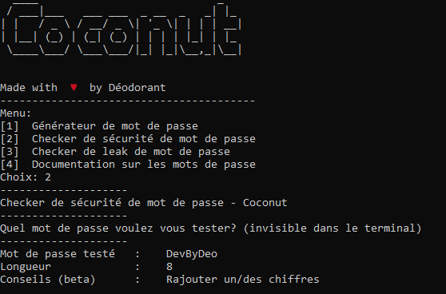
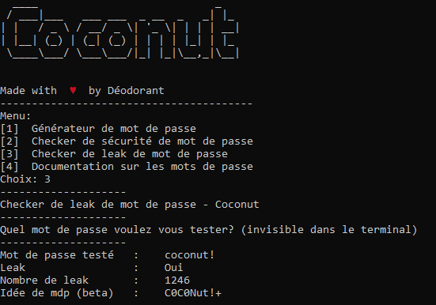
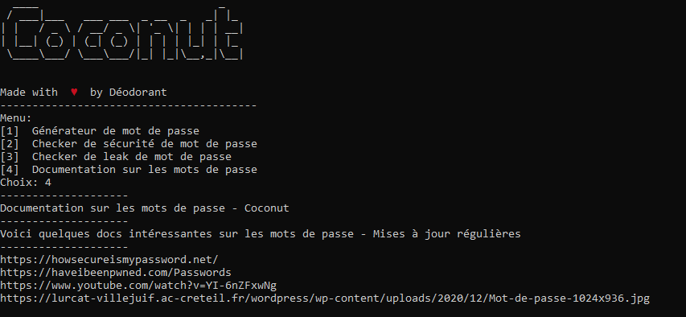

# Coconut 🥥
Coconut est un outil ayant plusieurs fonctions autour des mots de passe. Vous pouvez en générer, tester leur sécurité, vérifier si ils sont présents dans des leaks...

# Installation 🛠
```bash
git clone https://github.com/deo7/Coconut.git
cd Coconut
python setup.py install
```

# Utilisation 💻
```python
python coconut.py [-h] [-g] [-s] [-l] [-d]
```

# Demonstration 📸




Vous pouvez voir ci-dessus le menu d'aide (`python coconut.py --help`) et le menu d'interaction du programme (`python coconut.py`)


Dans le screen ci-dessus, j'ai généré un mot de passe en sélectionnant `1` dans le menu d'interaction, vous pouvez aussi utiliser `python coconut.py -g` pour aller plus vite



Avec `python coconut.py -s` ou en sélectionnant `2` dans le menu, vous pouvez tester la sécurité de votre mot de passe, le programme génèrera des "conseils" pour votre mot de passe (fonction en beta)



Avec cette fonction, vous pouvez tester si votre mot de passe est leak via un module utilisant le site [Have I Been Pwned](https://haveibeenpwned.com/Passwords), le programme génèrera une idée de mot de passe plus robuste à partir de votre mot de passe de base (fonction en beta)



Enfin, cette partie du programme vous propose quelques documentations intéressantes sur les mots de passe, ces documentations seront mises à jour régulièrement et si vous avez des propositions de docs vous pouvez me contacter

# Légal 🎓
Conformément à la license GNU General Public License v3.0, et comme explicitement indiqué dans celle-ci, vous avez des autorisations et des obligations vis-à-vis de ce projet que vous pouvez retrouver [juste ici](https://choosealicense.com/licenses/gpl-3.0/)

# Contact 📩
Vous pouvez me contacter
* Via Discord: Déodorant#7144
* Par mail: deodev@protonmail.com
